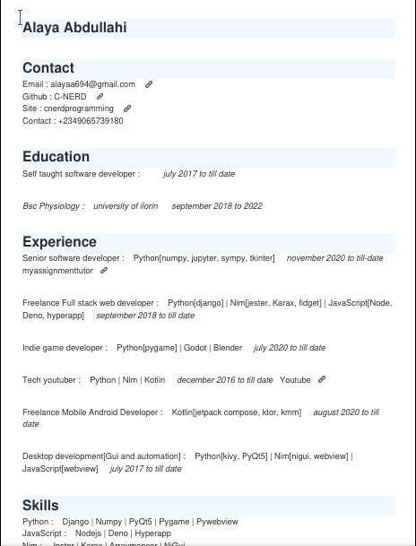

# GenerateCV
GenerateCV is a simple python project which helps to generate tech cv(resume) using a single template.

The template the program used is inspired from cv advice given in these youtube videos

- [How to create the perfect software developer resume](https://www.youtube.com/watch?v=GyjzOKdaioU&t=368s)
- [How to make an amazing software development resume](https://www.youtube.com/watch?v=Xa1pFemaGyc&t=5s)

# How to use the program
1. After cloning the repo, navigate into the projet's root directory and open the settings.json file
2. Inside the settings.json file replace the values of the objects with appropriate information
3. Then open a terminal in the root directory and type in `pip3 install -r requirements.txt` to install the dependences
3. Finally run `python3 cv.py` to generate your new CV(resume)

Your cv(resume) should be created in the project's root directory, have a nice job hunt.
